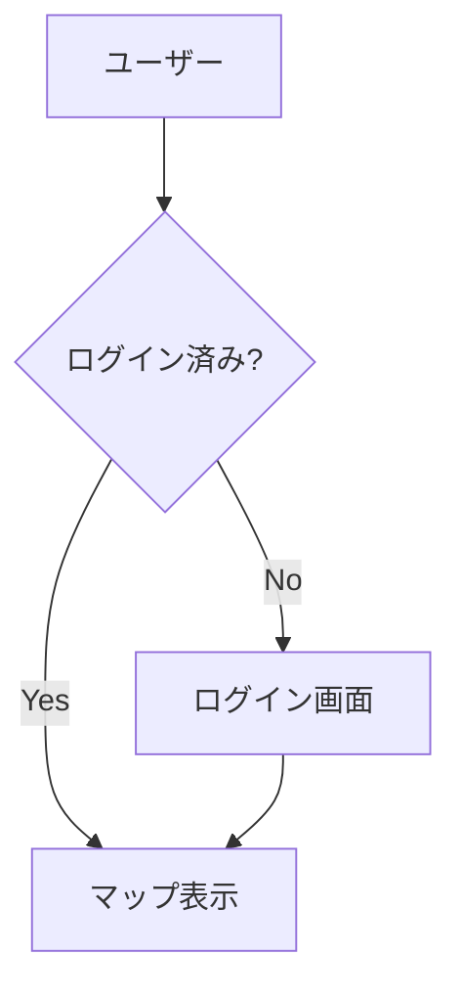

# CLAUDE.md

このファイルは、Claude Codeがこのプロジェクトを理解するための指示書です。

---

## プロジェクト概要

**OSHIATO（オシアト）** は、アイドルファン向けの「推し活」支援アプリです。

### コンセプト
「推しの足跡を現実世界で見つけ、記録し、辿る」

### 主な機能
- OOH広告やコラボカフェなど「推しスポット」を地図上で共有
- スポットへのチェックイン・訪問記録
- 訪問履歴を「光る足跡」と「推しカラーの糸」で可視化（軌跡マップ）
- 写真のEXIF情報から位置・日時を自動抽出

---

## 開発者について

### スキルレベル
- **HTML/CSS/JavaScript/PHP**: 基本理解あり
- **React/Next.js/Swift**: 未経験（Claudeと共に学習しながら開発）
- **Git**: 基本操作（add, commit, push, pull）は可能

### 重要な依頼
開発者は初級レベルのため、以下の場面では**都度解説**をお願いします：
- 新しい技術・概念の導入時
- 重要な設計判断を行う時
- エラーが発生した時
- コードの意味を理解する必要がある時

解説は簡潔に、必要に応じて例え話や図解を交えてください。

---

## 技術スタック

### Web版（Phase 1）
| カテゴリ | 技術 |
|----------|------|
| フレームワーク | Next.js 15.x (App Router) |
| 言語 | TypeScript |
| スタイル | CSS Modules |
| 地図 | Mapbox GL JS |
| バックエンド | Supabase (PostgreSQL + PostGIS) |
| ホスティング | Vercel |

### iOS版（Phase 2）
| カテゴリ | 技術 |
|----------|------|
| 言語 | Swift 5.x |
| UI | SwiftUI |
| 地図 | MapKit |
| バックエンド | Supabase Swift SDK |

### 共通バックエンド
- **データベース**: Supabase (PostgreSQL 15+ with PostGIS)
- **認証**: Phase 1-2は端末識別、Phase 3からSupabase Auth
- **ストレージ**: Supabase Storage
- **リアルタイム**: Supabase Realtime（Phase 3〜）

---

## ドキュメント分類

### 1. 永続的ドキュメント (`docs/`)

アプリケーション全体の「**何を作るか**」「**どう作るか**」を定義する恒久的なドキュメント。
アプリケーションの基本設計や方針が変わった時に更新されるが、それ以外は更新されない。
日々の開発において変更すべきタイミングがあれば、Claudeから更新の提案をすること。

#### ディレクトリ構造

```
docs/
├── Setup_Guide.md                   # 環境構築手順
├── UI_Design_Guide.md               # UIデザインルール
├── Repository_Structure.md          # リポジトリ構造定義
│
├── Requirements_v5_1.md             # 要件定義
├── Technical_Architecture_v5_1.md   # 技術構成
├── Sitemap_v5_1.md                  # サイトマップ
├── Database_Schema_v5_1.md          # DB定義
└── API_Specification_v5_1.md        # API定義
```

#### ファイル構成

- **Setup_Guide.md**
  - 環境構築手順
  - 必要なツールのインストール
  - 初回セットアップコマンド
  - 動作確認方法

- **UI_Design_Guide.md**
  - カラーパレット
  - フォント設定
  - コンポーネント規約
  - レスポンシブ対応ルール

- **Repository_Structure.md**
  - フォルダ・ファイル構成
  - ディレクトリの役割
  - ファイル配置のルール
  - 命名規則

- **Requirements_v5_1.md**
  - 機能要件、非機能要件
  - 前提条件（開発者スキル、環境、体制）
  - リスクと対策
  - 用語集

- **Technical_Architecture_v5_1.md**
  - 技術スタック（Web版/iOS版）
  - アーキテクチャ設計
  - Phase別構成
  - コスト計算
  - セキュリティ設計

- **Sitemap_v5_1.md**
  - 画面構成（Web版/iOS版）
  - ナビゲーション構造
  - Phase別画面一覧

- **Database_Schema_v5_1.md**
  - テーブル定義
  - ER図
  - マイグレーションSQL
  - インデックス戦略

- **API_Specification_v5_1.md**
  - API仕様
  - 実装例（TypeScript/Swift）
  - エラーハンドリング
  - ページネーション

### 2. 作業単位のドキュメント (`.steering/[YYYYMMDD]-[開発タイトル]/`)

特定の開発作業における「**今日何をするか**」を定義する一時的なステアリングファイル。
作業完了後は参照用として保持されるが、新しい作業では新しいディレクトリを作成する。

- **requirements.md**
  - 今回の作業の要求内容
  - 変更・追加する機能の説明
  - ユーザーストーリー
  - 受け入れ条件
  - 制約事項

- **design.md**
  - 変更内容の設計
  - 実装アプローチ
  - 変更するコンポーネント
  - データ構造の変更
  - 影響範囲の分析

- **decision.md**
  - 重要な決定事項の記録
  - 決定の背景・理由
  - 検討した選択肢
  - 決定による影響
  - 関連する永続ドキュメントへの反映状況

- **tasklist.md**
  - 具体的な実装タスク
  - タスクの進捗状況
  - 作業ログ
  - 発生した問題と解決策
  - 完了条件

### ステアリングディレクトリの命名規則

```
.steering/[YYYYMMDD]-[開発タイトル]/
```

- **YYYYMMDD**: 作業日（例: 20260322）
- **開発タイトル**: その日の主な作業内容を英語で（例: setup, map-display, spot-post）

### ディレクトリ構造の例

```
.steering/
├── 20260322-setup/
│   ├── requirements.md
│   ├── design.md
│   ├── decision.md
│   └── tasklist.md
│
├── 20260323-map-display/
│   ├── requirements.md
│   ├── design.md
│   ├── decision.md
│   └── tasklist.md
│
└── 20260324-spot-post/
    ├── requirements.md
    ├── design.md
    ├── decision.md
    └── tasklist.md
```

---

## ディレクトリ構成

```
Oshiato/
├── CLAUDE.md                   # このファイル
├── README.md                   # プロジェクト説明
│
├── docs/                       # 永続的ドキュメント
│   ├── Setup_Guide.md          # 環境構築手順
│   ├── UI_Design_Guide.md      # UIデザインルール
│   ├── Repository_Structure.md # リポジトリ構造定義
│   ├── Requirements_v5_1.md
│   ├── Technical_Architecture_v5_1.md
│   ├── Sitemap_v5_1.md
│   ├── Database_Schema_v5_1.md
│   └── API_Specification_v5_1.md
│
├── .steering/                  # 作業単位のドキュメント
│   ├── 20260322-setup/
│   │   ├── requirements.md
│   │   ├── design.md
│   │   ├── decision.md
│   │   └── tasklist.md
│   └── ...
│
├── apps/
│   ├── web/                    # Next.js Web版
│   │   ├── app/                # App Router
│   │   │   ├── page.tsx        # トップページ（マップ）
│   │   │   ├── layout.tsx      # 共通レイアウト
│   │   │   ├── spot/[id]/      # スポット詳細
│   │   │   ├── post/new/       # 投稿作成
│   │   │   ├── timeline/       # タイムライン
│   │   │   ├── oshi/           # 推し管理
│   │   │   ├── visits/         # 訪問ログ
│   │   │   └── trajectory/     # 軌跡マップ
│   │   ├── components/         # コンポーネント
│   │   │   ├── map/            # 地図関連
│   │   │   ├── post/           # 投稿関連
│   │   │   ├── oshi/           # 推し関連
│   │   │   └── ui/             # 共通UI
│   │   ├── lib/                # ユーティリティ
│   │   │   ├── supabase.ts     # Supabaseクライアント
│   │   │   ├── exif.ts         # EXIF処理
│   │   │   └── image.ts        # 画像処理
│   │   ├── styles/             # グローバルCSS
│   │   ├── types/              # 型定義
│   │   └── package.json
│   │
│   └── ios/                    # Swift iOS版（Phase 2）
│       └── OSHIATO/
│           ├── Views/
│           ├── Models/
│           ├── Services/
│           └── OSHIATO.xcodeproj
│
└── supabase/
    ├── migrations/             # DBマイグレーション
    │   └── 00001_initial.sql
    ├── seed.sql                # 初期データ
    └── config.toml
```

---

## 開発プロセス

### 基本原則

1. **永続ドキュメントの確認**: 機能追加や修正時は、まず`docs/`への影響を確認する
2. **設計変更時はドキュメント更新**: 基本設計に影響する変更は`docs/`内のドキュメントを同時に更新
3. **ファイル作成は承認制**: ファイル作成後は必ず開発者の確認・承認を得てから次に進む

### 日次の作業フロー

```
1. 作業開始
   │
   ├─→ .steering/[YYYYMMDD]-[タイトル]/ を作成
   │     ├── requirements.md（今日やること）
   │     ├── design.md（どう実装するか）
   │     └── tasklist.md（タスクと進捗）
   │
   ├─→ docs/ への影響を確認
   │     「この変更は基本設計に影響するか？」
   │
   ├─→ Claudeに作業開始を伝える
   │     「今日のステアリングは .steering/20260322-setup/ です」
   │
   ▼
2. 実装
   │
   ├─→ tasklist.mdのタスクを順番に消化
   ├─→ ファイル作成 → 開発者が確認・承認 → 次のファイル作成
   ├─→ 問題発生時はtasklist.mdに記録
   │
   ▼
3. レビュー
   │
   ├─→ Claudeがコードのポイントを説明
   ├─→ 開発者が内容を確認・理解
   ├─→ 必要に応じて修正
   │
   ▼
4. コミット（開発者が実行）
   │
   ├─→ Claudeがコミットメッセージを提案
   ├─→ 開発者がメッセージをレビュー・修正
   ├─→ 開発者がコミット・プッシュを実行
   │
   ▼
5. 作業終了
   │
   ├─→ tasklist.mdに進捗サマリーを記載
   ├─→ docs/ の更新が必要な場合は更新
   └─→ 明日への引き継ぎを記載
```

### ファイル作成のルール

**重要: Claudeはファイル作成後、必ず確認を取る**

```
【ファイル作成完了】
以下のファイルを作成しました：

ファイル: components/map/MapView.tsx
役割: 地図表示コンポーネント

内容を確認してください。
問題なければ「OK」、修正が必要なら指摘をお願いします。
```

- 1ファイルずつ作成し、確認を得る
- 複数ファイルを一度に作成しない
- 開発者の「OK」を得てから次に進む

### コミットのルール

**重要: Claudeはコミットを実行しない**

- コミットは必ず**開発者が実行**する
- Claudeはコミットメッセージを**提案**のみ行う
- 開発者はメッセージを**レビュー・修正**してからコミット

**Claudeの提案形式:**
```
【コミット提案】
以下の変更をコミットする準備ができました。

変更ファイル:
- app/page.tsx（新規作成）
- components/map/MapView.tsx（新規作成）
- lib/supabase.ts（新規作成）

提案コミットメッセージ:
feat: 地図表示機能を追加

このメッセージでよろしければ、以下のコマンドでコミットしてください：
git add .
git commit -m "feat: 地図表示機能を追加"
git push origin develop
```

### コミットのタイミング

- **機能単位**: 1つの機能が動作するようになったらコミット
- **小さく頻繁に**: 大きな変更を避け、小さなコミットを積み重ねる
- **動作する状態で**: コミット時点でエラーがない状態を維持

### デプロイフロー（Phase 1-2）

```
ローカル開発 → GitHubにプッシュ → Vercelが自動デプロイ
```

- `develop`ブランチへのプッシュでプレビュー環境にデプロイ
- 本番デプロイはPhase 3以降で検討

---

## ドキュメント管理の原則

### 基本原則

1. **Single Source of Truth**: 同じ情報を複数箇所に書かない
2. **最新を維持**: 実装と乖離したドキュメントは負債になる
3. **必要十分**: 過剰な詳細は避け、必要な情報のみ記載

### ファイル命名規則

| 対象 | 規則 | 例 |
|------|------|-----|
| 永続的ドキュメント | PascalCase + バージョン | Requirements_v5_1.md |
| ステアリング | YYYYMMDD-kebab-case | 20260322-map-display |
| ソースコード | kebab-case | spot-card.tsx |

### バージョン管理

- **メジャー更新**: 大きな方針変更（v5 → v6）
- **マイナー更新**: 機能追加・修正（v5.1 → v5.2）
- **バージョンはファイル名に含める**: Requirements_v5_1.md

### 更新ルール

| ドキュメント | 更新タイミング | 更新者 |
|-------------|---------------|--------|
| 永続的ドキュメント | 設計・方針変更時 | Claudeが提案 → 開発者が承認 |
| ステアリング | 作業中随時 | Claudeが記録 |
| CLAUDE.md | プロジェクト方針変更時 | 開発者が判断 |

### Claudeからの更新提案

永続的ドキュメントの更新が必要な場合、Claudeは以下の形式で提案する：

```
【ドキュメント更新提案】
対象: Database_Schema_v5_1.md
理由: 新しいテーブル「favorites」を追加したため
変更内容:
- テーブル一覧にfavoritesを追加
- ER図を更新
- マイグレーションSQLを追加

この更新を行ってよろしいですか？
```

---

## 図表・ダイアグラムのルール

### 基本方針

- **Mermaid記法を推奨**: GitHubで直接表示可能、Markdownに埋め込み可能
- **ASCII図も選択肢**: シンプルな図やテキストエディタでの編集が必要な場合
- **ツール不要で編集可能**: 特別なツールなしでMarkdown上で直接修正できること

### 図表の更新ルール

**重要: 設計変更時は図表も同時に更新する**

- コードと図表の乖離を防ぐため、設計変更時は対応する図表も必ず更新
- 更新対象の図表がある場合、Claudeは以下の形式で提案する：

```
【図表更新提案】
設計変更に伴い、以下の図表の更新が必要です：

対象: Database_Schema_v5_1.md 内のER図
変更内容: favoritesテーブルを追加

更新してよろしいですか？
```

### Mermaid記法（推奨）

フローチャート、シーケンス図、ER図などに使用。



**使用場面:**
- フローチャート（処理の流れ）
- シーケンス図（API呼び出しの順序）
- ER図（テーブル関係）
- 状態遷移図

**記載ルール:**
- コードブロックで囲む: ` ```mermaid ... ``` `
- 日本語ラベルを使用可能
- 複雑になりすぎる場合は分割する

### ASCII図

シンプルな構造図やディレクトリ構造に使用。

```
┌─────────────┐     ┌─────────────┐
│   Client    │────▶│   Server    │
└─────────────┘     └─────────────┘
```

**使用場面:**
- ディレクトリ構造
- シンプルなボックス図
- テーブル構造

**記載ルール:**
- 罫線文字を使用: `─ │ ┌ ┐ └ ┘ ├ ┤ ┬ ┴ ┼`
- 矢印: `→ ← ↑ ↓ ▶ ◀`
- コードブロックで囲む

### 使い分けの指針

| 図の種類 | 推奨形式 | 理由 |
|----------|----------|------|
| フローチャート | Mermaid | 複雑な分岐を表現しやすい |
| シーケンス図 | Mermaid | 時系列の表現に適している |
| ER図 | Mermaid | 関係性を明確に表現できる |
| ディレクトリ構造 | ASCII | ツリー構造が見やすい |
| シンプルな構成図 | ASCII | 素早く書ける |
| 画面遷移図 | Mermaid | 状態遷移として表現 |

---

## 品質基準

### コードレビュー

**レビュー方式**: 開発者が確認、Claudeがポイント説明

Claudeは実装後、以下の形式でレビューポイントを説明する：

```
【コードレビュー】

✅ 良い点:
- コンポーネントが適切に分割されている
- 型定義が明確

⚠️ 確認ポイント:
- L15: このuseEffectは依存配列が空ですが、意図通りですか？
- L32: エラーハンドリングを追加することを推奨します

📝 解説:
- useEffectの依存配列が空の場合、マウント時に1回だけ実行されます
  今回は初回データ取得なので、これで問題ありません
```

### テスト方針（Phase 1-2）

**方針**: 最低限の自動テスト（主要機能のみ）

| テスト種類 | Phase 1-2 | Phase 3以降 |
|-----------|:---------:|:-----------:|
| 手動テスト | ✅ 必須 | ✅ 必須 |
| ユニットテスト | ⚠️ 主要機能のみ | ✅ カバレッジ目標設定 |
| 結合テスト | ❌ なし | ✅ 導入検討 |
| E2Eテスト | ❌ なし | ⚠️ 必要に応じて |

**Phase 1-2でテストを書く対象:**
- ユーティリティ関数（EXIF抽出、画像処理など）
- 複雑なビジネスロジック
- バグが発生した箇所（再発防止）

### コード品質チェックリスト

Claudeは実装時、以下を確認する：

- [ ] TypeScriptの型エラーがない
- [ ] ESLintの警告がない
- [ ] コンソールエラーがない
- [ ] 意図通りに動作する
- [ ] エッジケースを考慮している

---

## コミュニケーションルール

### Claudeへの指示の出し方

**良い例:**
```
今日のステアリングは .steering/20260322-map-display/ です。
requirements.mdを確認して、地図表示機能の実装を始めましょう。
```

```
スポット投稿機能で、画像アップロード後にエラーが出ます。
エラーメッセージ: "Storage error: ..."
原因を調べて修正してください。
```

**避けるべき例:**
```
地図を作って（具体性がない）
```

```
エラーが出た（エラー内容がない）
```

### Claudeからの確認

Claudeは以下の場面で確認を取る：

1. **設計判断**: 複数の実装方法がある場合
2. **破壊的変更**: 既存コードの大幅な修正
3. **永続ドキュメント更新**: 要件や設計の変更
4. **新技術導入**: 未使用のライブラリ追加

**確認の形式:**
```
【確認】
〇〇について、以下の2つの方法があります：

A案: [説明]
- メリット: ...
- デメリット: ...

B案: [説明]
- メリット: ...
- デメリット: ...

どちらで進めますか？
```

### 作業の中断・再開

**中断時:**
```
今日はここまでにします。
tasklist.mdに進捗を記録してください。
```

**再開時:**
```
昨日の続きです。
.steering/20260322-map-display/tasklist.md を確認して、
残りのタスクを進めましょう。
```

---

## 開発ルール

### コーディング規約

#### TypeScript（Web版）
```typescript
// ファイル名: kebab-case
// spot-card.tsx, use-spots.ts

// コンポーネント名: PascalCase
export function SpotCard() { ... }

// 関数名: camelCase
async function getSpots() { ... }

// 型名: PascalCase
interface SpotData { ... }
type PostCategory = 'ooh' | 'collab_cafe' | ...

// 定数: UPPER_SNAKE_CASE
const MAX_IMAGES = 4
const DEFAULT_ZOOM_LEVEL = 14
```

#### CSS Modules
```css
/* ファイル名: コンポーネント名.module.css */
/* spot-card.module.css */

/* クラス名: camelCase */
.container { ... }
.spotTitle { ... }
.checkInButton { ... }
```

#### Swift（iOS版）
```swift
// ファイル名: PascalCase
// SpotCard.swift, MapView.swift

// 型名: PascalCase
struct SpotData { ... }

// 変数・関数名: camelCase
let spotCount = 10
func fetchSpots() async { ... }
```

### Git運用

#### ブランチ戦略

```
main                              # 本番リリース用
└── develop                       # 開発統合用
    ├── feature/map-display       # 機能ブランチ
    ├── feature/spot-post
    ├── feature/checkin
    └── fix/map-pin-not-showing   # バグ修正ブランチ
```

**ブランチの種類:**

| プレフィックス | 用途 | 例 |
|---------------|------|-----|
| `feature/` | 新機能開発 | `feature/map-display` |
| `fix/` | バグ修正 | `fix/map-pin-not-showing` |
| `refactor/` | リファクタリング | `refactor/supabase-client` |
| `docs/` | ドキュメント更新 | `docs/setup-guide` |

**運用フロー:**

```
1. 作業開始時
   └─→ developから機能ブランチを作成
       git checkout develop
       git pull origin develop
       git checkout -b feature/map-display

2. 作業中
   └─→ 機能ブランチで作業・コミット

3. 作業完了時
   └─→ developにマージ
       git checkout develop
       git merge feature/map-display
       git push origin develop

4. ブランチ削除（任意）
   └─→ git branch -d feature/map-display
```

**Claudeからのブランチ提案:**

作業開始時、Claudeは以下の形式でブランチを提案する：

```
【ブランチ提案】
今日の作業「地図表示機能の実装」に対して、
以下のブランチ名を提案します：

feature/map-display

このブランチを作成してよろしいですか？
作成する場合は以下のコマンドを実行してください：

git checkout develop
git pull origin develop
git checkout -b feature/map-display
```

#### コミットメッセージ
```
feat: 新機能追加
fix: バグ修正
docs: ドキュメント更新
style: コードスタイル修正
refactor: リファクタリング
```

例：
```
feat: スポット投稿機能を追加
fix: 地図のピンが表示されない問題を修正
docs: READMEにセットアップ手順を追加
```

---

## よく使うコマンド

### Web版（Next.js）

```bash
# 開発サーバー起動
cd apps/web
npm run dev

# ビルド
npm run build

# 本番モードで起動
npm run start

# 型チェック
npm run type-check

# パッケージ追加
npm install <package-name>
```

### Supabase

```bash
# Supabase CLI ログイン
npx supabase login

# ローカル開発環境起動
npx supabase start

# マイグレーション作成
npx supabase migration new <migration-name>

# マイグレーション適用
npx supabase db push

# 型定義生成
npx supabase gen types typescript --project-id <project-id> > apps/web/types/database.ts
```

### iOS版（Phase 2）

```bash
# Xcodeでプロジェクトを開く
open apps/ios/OSHIATO/OSHIATO.xcodeproj

# シミュレータでビルド・実行
# Xcode内で Cmd + R
```

---

## 環境変数

### Web版 (.env.local)

```bash
# Supabase
NEXT_PUBLIC_SUPABASE_URL=https://xxx.supabase.co
NEXT_PUBLIC_SUPABASE_ANON_KEY=eyJ...

# Mapbox
NEXT_PUBLIC_MAPBOX_TOKEN=pk.xxx
```

### iOS版

Xcode内の「Secrets.plist」または環境変数で管理：
```
SUPABASE_URL=https://xxx.supabase.co
SUPABASE_ANON_KEY=eyJ...
```

---

## データベース

### 主要テーブル（Phase 1-2）

| テーブル | 説明 |
|----------|------|
| users | ユーザー（端末識別） |
| oshis | 推しマスタ |
| user_oshis | ユーザー×推し（テーマカラー） |
| areas | エリアマスタ |
| spots | スポット（位置情報） |
| posts | 投稿（スポットに紐づく） |
| post_images | 投稿画像 |
| check_ins | チェックイン記録 |
| visit_logs | 訪問ログ（軌跡マップ用） |

### PostGIS関数

```sql
-- 近くのスポットを検索（500m以内）
SELECT * FROM find_nearby_spots(35.6812, 139.7671, 500);
```

---

## Phase構成

| Phase | 期間 | 内容 | 現在 |
|-------|------|------|:----:|
| **Phase 1** | Week 1 | Web版プロトタイプ | ← |
| **Phase 2** | Week 2-3 | iOS版プロトタイプ | |
| **Phase 3** | Week 4-11 | MVP完成・リリース | |
| **Phase 4** | Week 12〜 | スケール・拡張 | |

### Phase 1 完了基準
- [ ] 地図が表示される
- [ ] スポットにピンが立つ
- [ ] 写真付きで投稿できる（EXIF抽出）
- [ ] 推しを登録・管理できる
- [ ] スポット詳細が見られる
- [ ] チェックインできる
- [ ] 訪問ログが見られる
- [ ] 軌跡マップが表示される
- [ ] タイムラインで投稿一覧が見える
- [ ] スマホブラウザでも操作可能

---

## 注意事項

### Vercel依存を避ける
以下のVercel固有機能は**使用しない**でください（将来の移行のため）：
- ~~Vercel KV~~ → Supabaseを使用
- ~~Vercel Blob~~ → Supabase Storageを使用
- ~~Vercel Edge Config~~ → 環境変数を使用
- ~~@vercel/analytics~~ → PostHogを使用（Phase 3〜）
- ~~@vercel/og~~ → 標準Canvas APIを使用

### 画像処理
1. EXIF情報を抽出（GPS座標・撮影日時）
2. 抽出したデータをDBに保存
3. 画像からEXIFを削除
4. WebPに変換（最大1920px、品質80%）
5. Supabase Storageにアップロード

### プライバシー
- 公開される画像からはEXIF情報を完全削除
- 撮影位置（taken_location）は本人のみ閲覧可能
- 匿名ネームで投稿（本名は非公開）

---

## トラブルシューティング

### よくある問題

#### npm run dev が起動しない
```bash
# node_modulesを削除して再インストール
rm -rf node_modules
npm install
```

#### Supabaseに接続できない
1. `.env.local`の環境変数を確認
2. Supabaseダッシュボードでプロジェクトが起動しているか確認
3. RLSポリシーを確認

#### 地図が表示されない
1. `NEXT_PUBLIC_MAPBOX_TOKEN`が設定されているか確認
2. Mapboxダッシュボードでトークンが有効か確認
3. ブラウザの開発者ツールでエラーを確認

---

## 参考ドキュメント

プロジェクトの詳細は`docs/`フォルダ内のドキュメントを参照：

| ドキュメント | 内容 |
|-------------|------|
| Setup_Guide.md | 環境構築手順、初回セットアップ |
| UI_Design_Guide.md | カラー、フォント、コンポーネント規約 |
| Repository_Structure.md | フォルダ構成、ディレクトリの役割、ファイル配置ルール |
| Requirements_v5_1.md | 機能要件、非機能要件、前提条件、リスク |
| Technical_Architecture_v5_1.md | 技術スタック、アーキテクチャ、コスト |
| Sitemap_v5_1.md | 画面構成、ナビゲーション |
| Database_Schema_v5_1.md | テーブル定義、ER図、マイグレーション |
| API_Specification_v5_1.md | API仕様、実装例、エラー処理 |

---

## Claudeへのお願い

1. **解説を丁寧に**: 新しい概念や技術は、なぜそうするのかを含めて説明してください
2. **段階的に進める**: 一度に多くの変更をせず、小さなステップで進めてください
3. **エラー時は原因から**: エラーが起きたら、何が原因かを説明してから修正してください
4. **選択肢を提示**: 複数の方法がある場合は、メリット・デメリットを示して選んでもらってください
5. **確認を取る**: 重要な判断や大きな変更の前には、必ず確認を取ってください
6. **リント・型チェックを実施**: コード変更後は必ずリント（ESLint）と型チェック（TypeScript）を実施し、エラーがないことを確認してください
7. **セキュリティを意識**: XSS対策、入力バリデーション、SQLインジェクション対策など、セキュリティを意識したコーディングを行ってください
